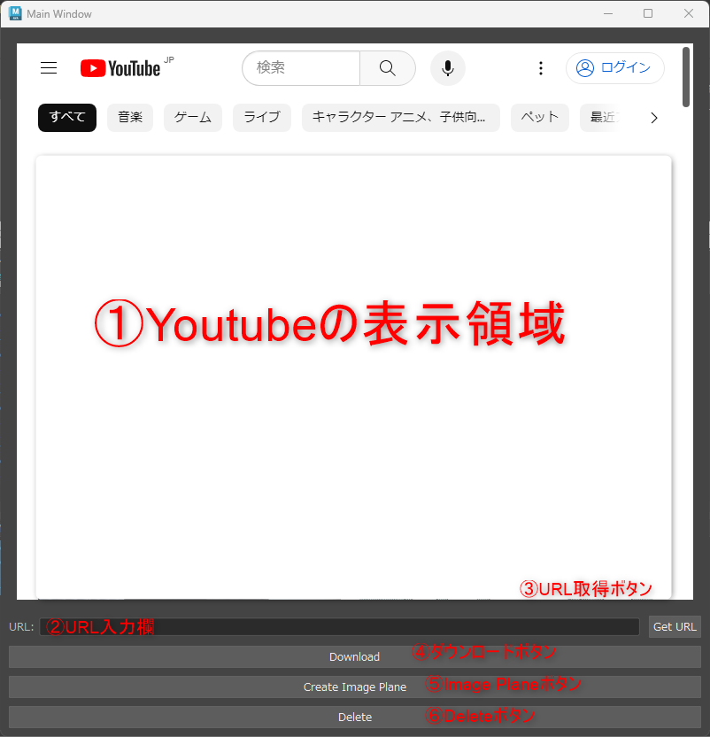
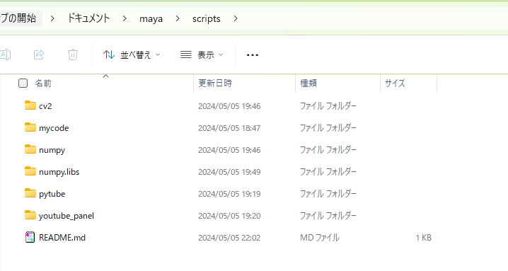
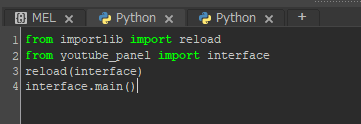

# YoutubePanel
Youtubeから動画をダウンロードしシーケンスファイルに変換、それをリファレンスとしてImagePlaneに表示するツールです。  
※ 著作権法など各種法令に違反する行為は行わないでください。  
※ 個人利用の範囲であればダウンロードは問題ないはずですが、動画が違法にアップロードされていないものであることを確認してください。

## UI


|#|説明|
|---|---|
|①|Youtubeをブラウジングする領域|
|②|ダウンロード対象のURLの入力欄|
|③|URL取得ボタン。押下すると、YoutubeのURLが②に入力される。|
|④|ダウンロードボタン。押下すると、Youtubeの動画をダウンロードする。|
|⑤|Image Planeボタン。押下すると、ダウンロードされた動画からImage Planeを作成する。|
|⑥|ダウンロードされたファイルを削除する。|

## 起動方法
1. Mayaのパスが通っているフォルダに配置してください。  
    e.g.  
    {ユーザ}\Documents\maya\scripts  
    ※ youtube_panel以外のフォルダはpipモジュールです。必要であれば適切な場所に再配置してください。  
    

1. スクリプトエディタ(python)で以下のスクリプトを実行してください。
    ```
    from importlib import reload
    from youtube_panel import interface
    reload(interface)
    interface.main()
    ```
    

## 利用方法
1. Youtubeでダウンロードしたい動画をブラウジングする。  
    URLをすでに持っている場合は、②に直接入力して次の手順を飛ばしても構いません。

1. URL取得ボタン③を押下する。
    ボタンを押下すると、YoutubeのURLが②に入力されます。

1. ダウンロードボタン④を押下する。  
    ボタンを押下すると、Youtubeの動画がダウンロードされます。  
    ダウンロードされるファイルは以下の通りです。 

    保存先フォルダ:  
    {tmp}/youtube_panel  
    保存ファイル名:  
    tmp.mp4
    frame_0000000.jpg - frame_{最後のフレーム}.jpg

1. Image Planeボタン⑤を押下する。
    ボタンを押下すると、ダウンロードされた動画からImage Planeが作成されます。  
    作成されたImage Planeは、シーン内に配置されます。

1. ダウンロードされたファイルを削除する場合は、削除ボタン⑥を押下する。
